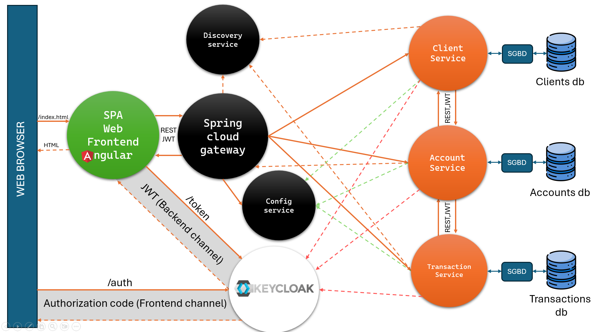
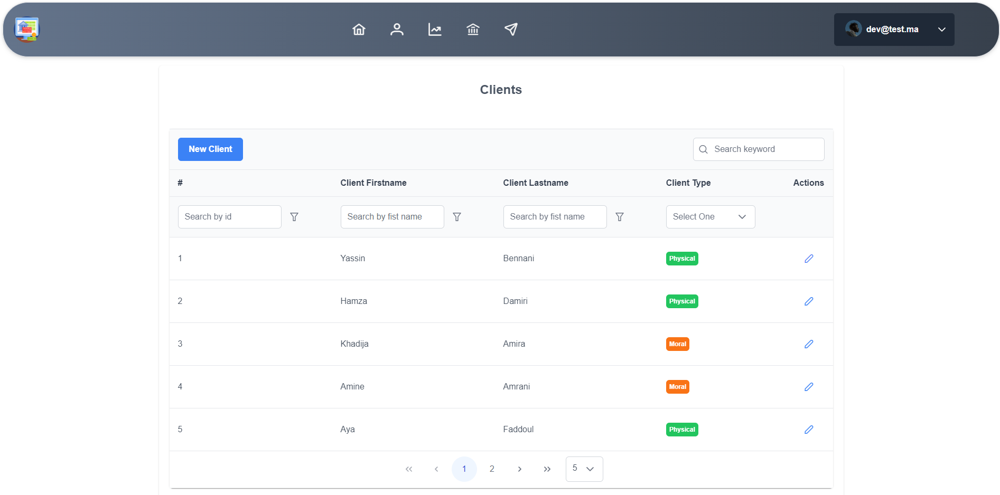
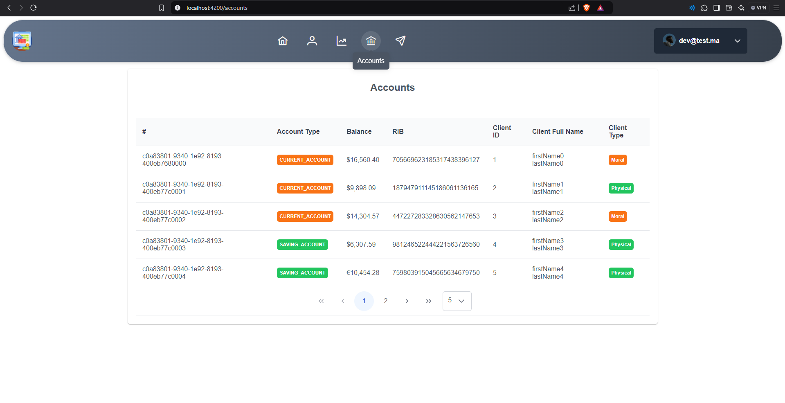
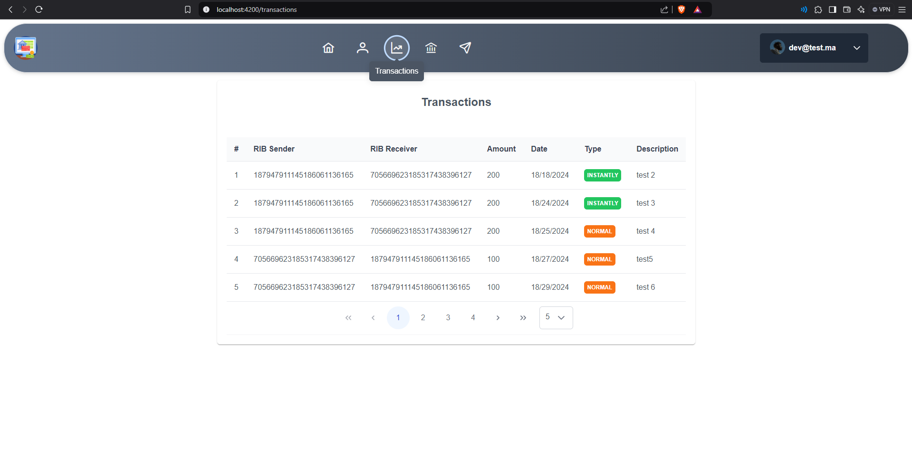
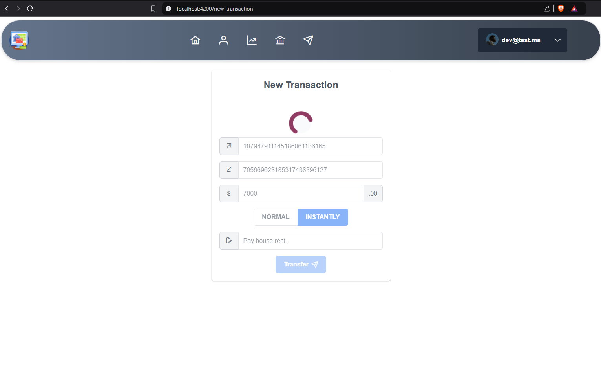
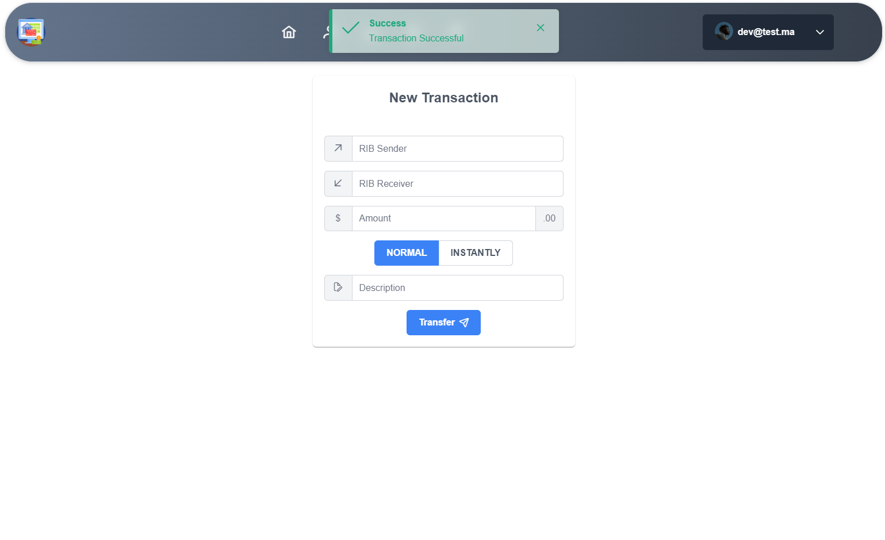

# E-Banking App in Microservices 🚀

Welcome to the E-Banking App, a microservices-based backend application built with Java Spring Boot and a frontend developed using Angular. This project aims at providing a modular architecture to manage clients, accounts, and transactions with central authentication through Keycloak.

## 🧩 Architecture


## ⚡ Features

- **Microservices Architecture**: Adopted for better scalability and maintainability.
- **Spring Boot**: Backend services developed using Spring Boot.
- **Angular Frontend**: Client-side developed using Angular.
- **Central Authentication**: Using Keycloak for secure user management.
- **API Gateway**: Using Spring Cloud Gateway for routing requests.
- **Configuration Management**: Centralized configuration with Spring Cloud Config.
- **Service Discovery**: Implemented using Eureka Server.

## 📷 ScreenShots






## 📁 Repository Structure

- `/discovery-service`: Service responsible for registering and discovering other services.
- `/config-service`: Manages external configurations centrally.
- `/gateway-service`: API Gateway handling client requests.
- `/client-service`: Manages client-related operations.
- `/account-service`: Handles account-related functionalities.
- `/transaction-service`: Deals with transaction data.
- `/e-banking_app_ui`: Angular-based frontend project.

## 🔧 Services Overview

### Discovery Service
- **Port**: 8761
- **Tech**: spring-cloud-starter-netflix-eureka-server
- **Role**: Register and discover other services.

### Config Service
- **Port**: 9999
- **Tech**: spring-cloud-config-server
- **Role**: Provide configurations to microservices.

### Gateway Service
- **Port**: 8888
- **Tech**: spring-cloud-starter-gateway
- **Role**: Route requests to respective microservices.

### Client Service
- **Port**: 8082
- **Endpoints**:
    - `GET /clients`: View all clients
    - `POST /clients/new`: Add a new client
    - `GET /clients/{id}`: View specific client
    - `PUT /clients/{id}/update`: Update client
    - `DELETE /clients/{id}/delete`: Delete client

### Account Service
- **Port**: 8081
- **Endpoints**:
    - `GET /accounts`: View all accounts
    - `POST /accounts/new`: Add a new account
    - `GET /accounts/{id}`: View specific account
    - `PUT /accounts/{id}/update`: Update account
    - `DELETE /accounts/{id}/delete`: Delete account

### Transaction Service
- **Port**: 8083
- **Endpoints**:
    - `GET /transactions`: View all transactions
    - `POST /transactions/new`: Add a new transaction
    - `GET /transactions/{id}`: View specific transaction
    - `PUT /transactions/{id}/update`: Update transaction
    - `DELETE /transactions/{id}/delete`: Delete transaction

### Angular Frontend
- **Port**: 4200

### Central Authentication (Keycloak)
- **Port**: 80

## 🔗 Access Points

- **Account Service**: [http://localhost:8888/account-service](http://localhost:8888/account-service)
- **Client Service**: [http://localhost:8888/client-service](http://localhost:8888/client-service)
- **Transaction Service**: [http://localhost:8888/transaction-service](http://localhost:8888/transaction-service)

## 🚀 Getting Started

1. Clone the repository:
   ```bash
   git clone https://github.com/Dev7HD/e-banking_app_in_microservices.git
   ```
2. Navigate to the project directory and build the services using Docker Compose:
   ```bash
   cd e-banking_app_in_microservices
   docker-compose up --build
   ```
3. Access the various services through the API Gateway.

## 📜 Health Checks

Each service is equipped with a health checker to ensure they're up and running. Ensure that all services are healthy for a seamless operation.

## 🤝 Contributing

Feel free to fork the repository and submit pull requests. For major changes, please open a discussion to communicate what you'd like to change.

## 📃 License

This repository and its contents are licensed under the MIT License.

Happy Coding! 🎉

---

Note: Provide feedback to enhance the documentation or report issues in the repository.